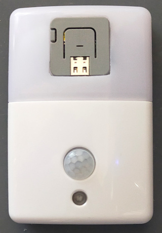
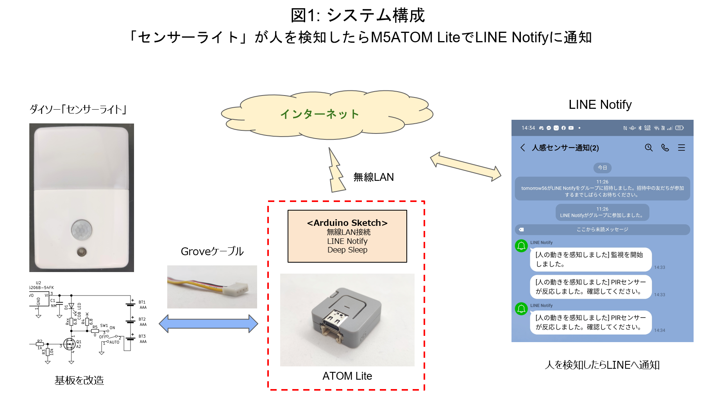
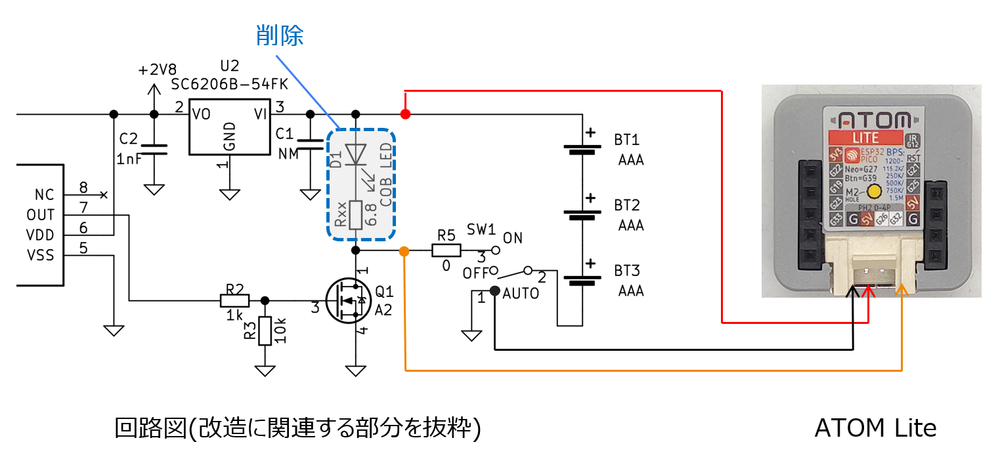

# M5ATOM_PIR_Sensor_sample
Modify DAISO Sensor Light to M5Stack Unit and connect to ATOM Lite

## What you can make with this project

## System Image

## Connection to ATOM Lite

## BOM
### Sensor Light (Daiso)
https://jp.daisonet.com/products/4972822710220

### M5Stack "ATOM Lite"
https://docs.m5stack.com/en/core/atom_lite

### Seeed studio "Grove 4 pin Cable"
https://www.seeedstudio.com/Grove-Universal-4-Pin-20cm-Unbuckled-Cable-5-PCs-Pack-p-749.html
